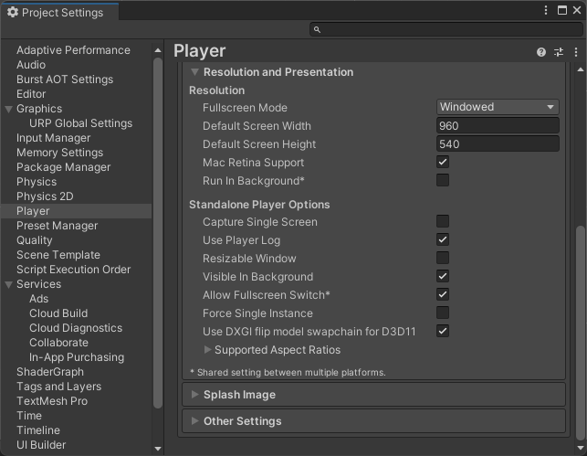

# 開発ルール・手順 - 画面サイズおよびフルスクリーン設定

## 画面サイズ設定



- 「Windowed」でデフォルトがウィンドウモードになる。
- ウィンドウモード時の解像度はFullHDの半分の960x540とする。
- 「Allow FullScreen Switch」にチェックが入っていると、[「Alt + Enter」でフルスクリーンの切り替えが可能](https://santerabyte.com/unity-allow-fullscreen-switch/)。

ただし、この方法だとフルスクリーンから通常ウィンドウに戻した時ウィンドウサイズが変わってしまう。

ウィンドウサイズの変更自体は

```

Screen.SetResolution(960, 540, false, 60);

```

(trueならフルスクリーン)

でいつでも出来るが、

ゲーム初期化時に選択させたりするにはもう少し詳しいものを作る必要がありそうだ。

ひとまず、Scripts/DevTools/ResolutionResetterというスクリプトを作成し、何らかのオブジェクトにアタッチしStart関数が実行されれば解像度を元に戻せるようにした。